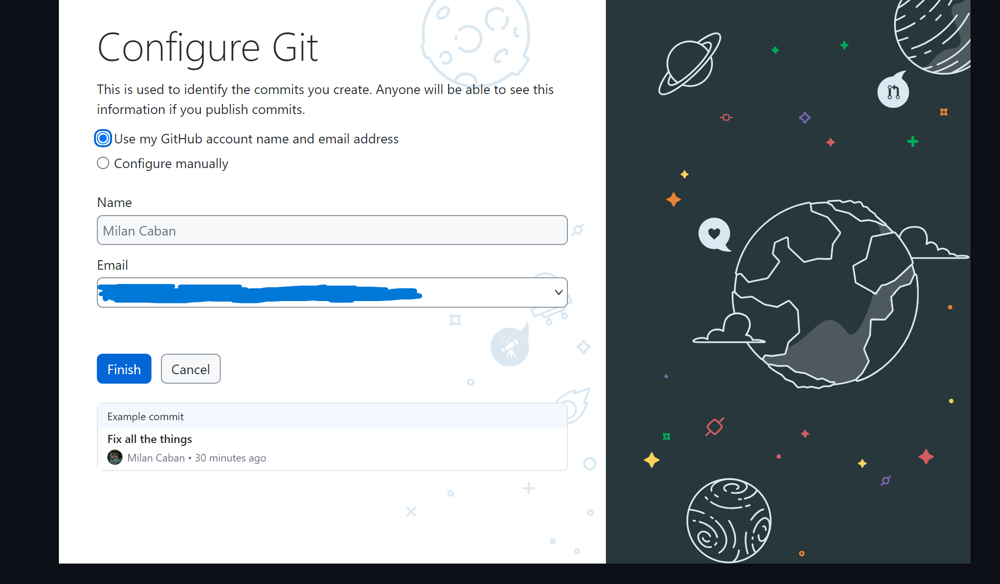

# GitHub desktop

There are many ways how to add or edit files in GitHub repository, you can do it on a web (not recommended), using CLI (use it if you know what are you doing) or use one of many [Git GUI clients](https://git-scm.com/downloads/guis) I recommend [Git extensions](https://gitextensions.github.io/). Visual studio code has plugin for Git and Visual studio has it out of the box. Here I explain how to install and use one of the simplest GUI clients for Git.

1. Download and open GitHub desktop from [website](https://desktop.github.com/download/)

2. If you do not have Git installed (again, Git is separated software and GitHub desktop functions only as an abstraction for it) GitHub desktop should ask you to do it but if not you can download it [here](https://git-scm.com/downloads), always click next in installation anless you understand the question and options then you can choose.

3. After installation in welcome screen choose "Sign in to GitHub.com" option.

4. In configure screen you can leave everything as it is.

5. After signing in choose "Clone a repository from the internet" if you have existing repository on GitHub or somewhere else ( for example GitLab).

6. Then Click "URL" and specify URL of repository you want to clone. You can also specify a location to which you want to clone a repository.

You can get url by clicking "Code" on a web then "HTTPS" and then copy url. Here you can download repository in a zip as well.

7. After you clone the repository you are presented with this screen.

1 - Name of current repository if you cloned multiple repositories you can easily switch between them.

2 - Name of current branch if your repository has multiple branches you can switch between them, but you cannot have changes on your current branch as you will lose them if you switch to other branch.

3 - This button will update your repository from internet, please click it always before you start working to avoid merge conflicts.

8. If your create any change to files in repository (if folders are empty, they are not considered as a change) Git wil detect it.

1 - You choose which files to include in commit by selecting or deselcting them.

2 - Here you can write commit message which explains what you did int his commit. Here are two fields for title and description of a commit, but if you have only one field first is title and the rest is description, **please do write descriptive commit messages**.

### !!! Do not remove .git folder in repository, because this is where all the commits are saved and if you remove it, you basically delete the whole repository.

9. When you commit your changes, right they are present only in your local copy therefore you need to upload them to the internet clicking "push" button you have two places where you can do it.

You don't have push after every commit, but you should push everything you have done, when you stop working, so others can update their local copies, you can push multiple commits at once.