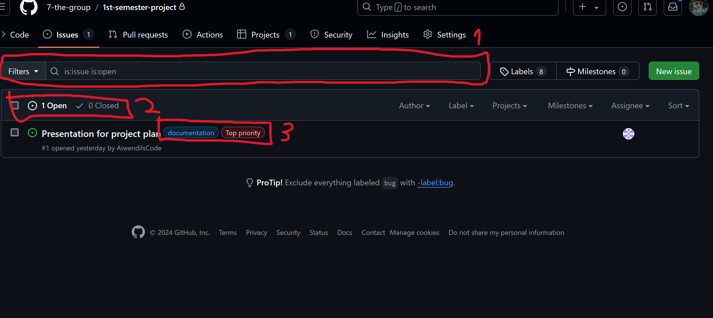
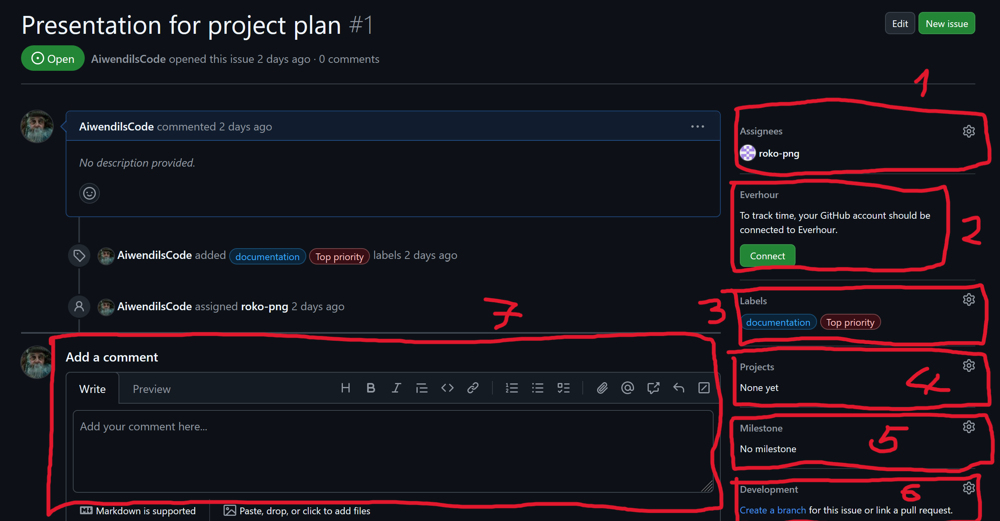

# Issues

Issues represents Bugs or features which should be solved or implemented in repository. Usually they are used for discussing implementation of a feature or requesting it by creating an issue.

1 - Here you can filter issues by author, label, assignee, ...

2 - Here you can see how many issues are open or closed.
- **Closed** - Issue is finished
- **Open** - Not finished issue

3 - Every issue can have labels, GitHub has some default labels, but you can create your own (as I created Top priority label).

1 - Here you can find people to whom this issue is assigned.

2 - If you have Everhour you can track how many hours you spent on this issue.

3 - Here are all labels added to this issue.

4 - Every issue can be connected to a project to which it belongs.

5 - If you assign issue to milestone, issue will become one of things that needs to be done so milestone can be finished.

6 - You can create branch or assign pull reqeust with code or files related to this issue.

7 - You can add comments and participate in discussion, you can attach files as well. Comments support markdown so you can format your comment.

Not visible in image, but if you scroll down in issue you can subscribe to issue to receive notifications on email.