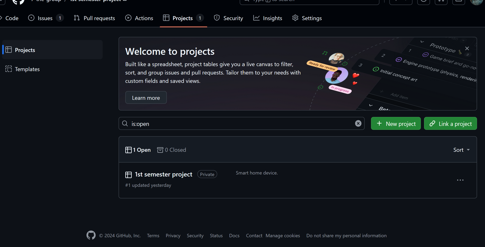
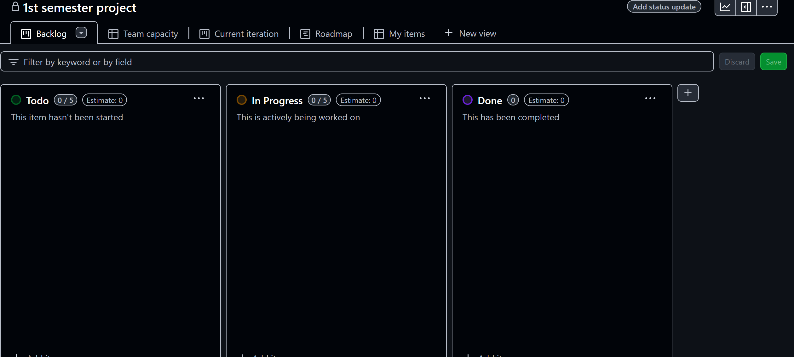

# Projects

Here are located all the projects, which are owned by user (or in this case by organization).

After clicking on a project you can create tasks and assign them, however functionality is very limited if you have a free version. Therefore it is good idea to use other application for that.