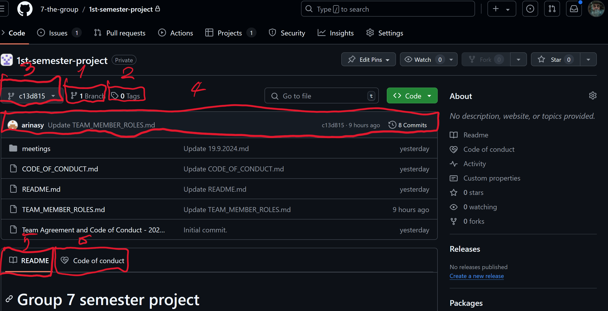

# Repository

1 - Shows number of branches repository has.

2 - Shows number of tags repository has.

3 - Shows Branch or commit (in this case commit), which is currently displayed bellow in files section. Using this button you can easily switch between branches and view the state of repository in particular branch. You will usualy see main or master.

4 - Shows most recent commit in branch and number of commits in branch.

6 and 7 - These tabs do not have to be visible it depends on presence of particular files at the root of the repository. These tabs simply display content of those files. Tabs and its coresponding files (case insesitive):
- README - README.md
- Code of conduct - CODE_OF_CODUCT.md
- License - LICENSE.md